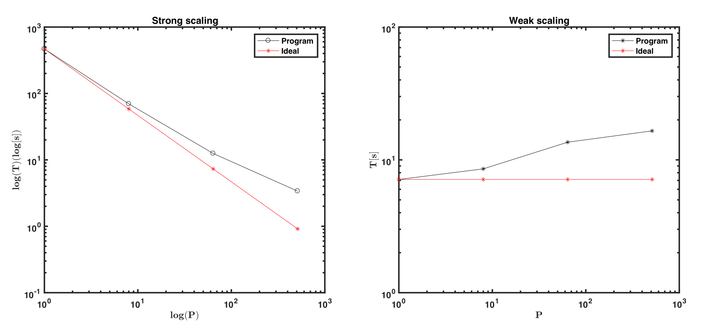

# Wave3Dfd

Wave3Dfd simulates seismic wave propagation in 3D using Velocity-Stress Staggered-Grid formulation (VS SG). The algorithm approximation is 4th order in space and 2nd order in time. The code is also capable of computing the Fréchet derivatives with the adjoint formulation. To calculate the Fréchet derivatives, the user has to provide the adjoint source for every receiver.

## Parallel implementation details

Simple domain decomposition using MPI for the communication between subdomains and OpenMP for multithreading.

### Getting started
    $ git clone https://github.com/armandoespindola/wave3Dfd.git

### Prerequisites
    * MPI - OpenMP

### Running example
    Example details: Homogeneous model
    $ make clean
    $ make all
    $ cd Example/
    Running conde in 8 cores (8 subdomains) 
    $ mpirun -np 8 ./wave3Dfd.out -nFile parameter.par

armando.espindolacarmona@kaust.edu.sa
